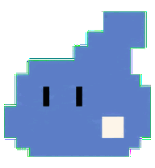

# 缓缓 · Huanhuan

一只安静、专注的灰蓝色像素小生命，为 Codex 桌面宠物设计。

不设定物种，不强调四肢。用不规则的阶梯轮廓、两道眼睛，以及轻微的伸缩和摆动表现生命力。

## 当前版本

- 包含九组基础动画：待机、向右移动、向左移动、挥动、跳跃、失败、等待、工作、审阅。
- 使用 v1 精灵图：8 列 × 9 行，1536 × 1872 像素，透明 WebP。
- 图集格式、透明度和色键残留检查通过。
- 不包含完整的 16 向鼠标注视动作；当前发布的是基础动画版本。

## 安装

下载仓库，将仓库根目录中的 `pet.json` 和 `spritesheet.webp` 放入 `$CODEX_HOME/pets/huanhuan/`。

未设置 `CODEX_HOME` 时，通常使用用户目录下的 `.codex/pets/huanhuan/`；Windows 对应 `%USERPROFILE%\.codex\pets\huanhuan\`。

在 Codex 宠物设置中选择「缓缓」，并打开宠物显示。若列表未刷新，重启应用后再选择。

## 文件

- `pet.json`、`spritesheet.webp`：可安装的宠物文件。
- `huanhuan.png`、`huanhuan-preview.gif`、`abstract-pet-concepts.png`：形象与设计预览。
- 其余九个 GIF：独立动作预览。
- [design.md](design.md)：设计说明。

设计与动画素材由 AI 辅助生成，并经过人工选择和迭代。Claude 的简洁像素表现是风格参考，本项目为独立的个人设计，与 Anthropic 或 OpenAI 无隶属关系。
