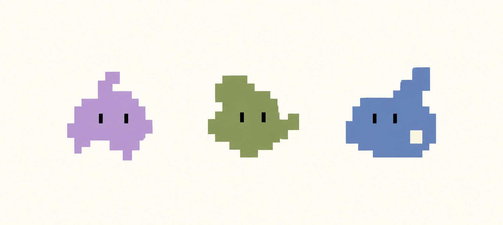

# 设计说明

## 最初的要求

参考 Claude 吉祥物简洁、容易辨认的像素表现，重新设计轮廓。气质是「安静、专注」；不要具体动物，希望是一个说不清是什么、但有生命力的小东西。

## 最终选择

选择概念图最右侧的灰蓝色形象，命名为「缓缓」。

保留宽而稳定的下部轮廓、向右上方延伸的柔软凸起、两道深色眼睛和浅奶油色方块。动作主要依靠整体伸缩、眼睛变化和顶部轻摆，保持抽象感。

## 本次交付范围

九组基础动作已完成并打包。完整的方向注视动画尚未完成，因此没有放入安装图集。GIF 用于展示动作；应用实际播放以 `spritesheet.webp` 和 Codex 的动画规则为准。
